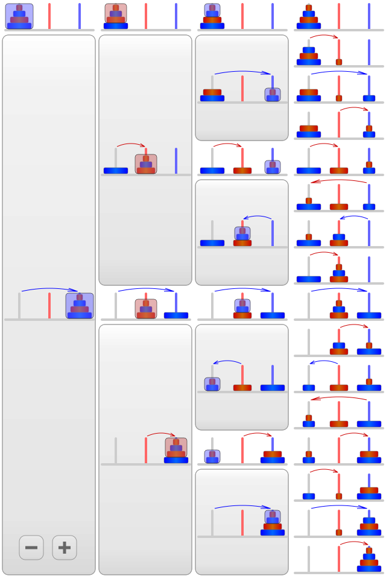

# Laboratorio 11 - Metodi, Ricorsione

## 0) Funzioni e Metodi

```go
package main

import "fmt"

type rect struct {
    width, height int
}

func area(r rect) int {
    return r.width * r.height
}

func perim(r rect) int {
    return 2*r.width + 2*r.height
}

func main() {
    r := rect{width: 10, height: 5}

    fmt.Println("area: ", area(r))
    fmt.Println("perim:", perim(r))
}
```

```go
package main

import "fmt"

type rect struct {
    width, height int
}

func (r rect) area() int {
    return r.width * r.height
}

func (r rect) perim() int {
    return 2*r.width + 2*r.height
}

func main() {
    r := rect{width: 10, height: 5}

    fmt.Println("area: ", r.area())
    fmt.Println("perim:", r.perim())
}
```

## 1) Metodi - Carte da gioco

Si consideri il seguente programma per la  rappresentazione e gestione di carte da gioco "francesi" (Esercizio1, Lezione 9).
Trasformare le funzioni `Mischia`, `Preleva` e `Riponi` del seguente codice in Metodi.

```go
package main

import "fmt"
import "math/rand"

type CartaDaGioco struct {
	simbolo string
	seme string
}

type Mazzo struct {
	carte []CartaDaGioco
	ncarte int
}

var semi = [4]string{"quadri", "picche", "cuori", "fiori"}
var simboli = [10]string{"asso", "due", "tre", "quattro", "cinque", "sei", "sette", "fante", "donna", "re"}

//crea una carta da gioco: restituisce la carta da gioco dato il seme e il simbolo
func CreaCarta(simbolo, seme string) CartaDaGioco {
	return CartaDaGioco{simbolo, seme}
}

//crea e restituisce un mazzo di 40 carte da gioco
func CreaMazzo() Mazzo {
	tmp := make([]CartaDaGioco, 40)
	k := 0	
	for i:=0; i<4; i++ {
		for j:=0; j<10; j++{
			carta := CreaCarta(simboli[j], semi[i])
			tmp[k] = carta
			k++
		}
	}
	mazzo := Mazzo{carte:tmp, ncarte:40} 
	return mazzo
}


//mischia un mazzo di carte, usando il pacchetto "math/rand"
func Mischia(m Mazzo){
	for i := range m.carte {
		j := rand.Intn(i + 1)
		m.carte[i], m.carte[j] = m.carte[j], m.carte[i]
	}
}

//simula il prelievo di una carta dalla cima di un mazzo;
//restituisce la tripla (c,m,nil), dove c è la carta
//in cima al mazzo, m è un mazzo senza c, se il mazzo non è vuoto;
//restituisce (c,m,err), dove c ed m sono arbitrari, ed err è un
//valore diverso da nil, altrimenti
func Preleva(m Mazzo) (CartaDaGioco, Mazzo, error) {
	if m.ncarte > 0 { 
		prelevata := m.carte[0]
		m.carte = m.carte[1:len(m.carte)]
		m.ncarte--
		return prelevata, m, nil
	} else {
		var empty_m Mazzo 
		return CartaDaGioco{"", ""}, empty_m, fmt.Errorf("Mazzo Terminato")
	}
}

//simula la posa di una carta in cima ad un mazzo
//restituisce la coppia (m,nil), dove m è un mazzo con l'aggiunta di
//c, se il mazzo non è pieno;
//restituisce (m,err), con m arbitrario ed err un valore diverso da
//nil, altrimenti
func Riponi(m Mazzo, c CartaDaGioco) (Mazzo, error) {
	if m.ncarte < 40 {
		m.carte = append([]CartaDaGioco{c}, m.carte...)
		m.ncarte++
		return m, nil
	} else {
		return m, fmt.Errorf("Mazzo Pieno")
	}
}

func main() {
	
	mazzo := CreaMazzo()
	
	fmt.Println(mazzo)
	fmt.Println()
	
	Mischia(mazzo)
	fmt.Println(mazzo)

	carta, mazzo, _ := Preleva(mazzo)
	fmt.Println()
	fmt.Println(carta)
	fmt.Println(mazzo)

	mazzo, _ = Riponi(mazzo, carta)
	fmt.Println()
	fmt.Println(mazzo)

	mazzo, _ = Riponi(mazzo, carta)
	fmt.Println()
	fmt.Println(mazzo)
}

```

## 2) Ricorsione - Potenze

La seguente funzione `Pow` calcola ricorsivamente `x` elevato a `n`

```text
x^0 = 1               --- caso base
x^n = x * x^(n-1)     
```

```go
package main

import "fmt"

func Pow(x float64, n uint) float64 {
	fmt.Println("n :", n)
	if n == 0 {
		return 1
	}
	return x * Pow(x, n-1) // calcola ricorsivamente x^(n - 1)
}

func main() {
	fmt.Println(Pow(2,4))
}

```

## 2bis) Ricorsione - Potenze (2)

La stessa funzione può essere scritta in modo più efficiente:

```text
x^0 = 1               --- caso base
x^n = (x^(n/2))^2     se n > 0 e n è pari
x^n = x * x^(n-1)     se n > 0 e n è dispari
```

```go
package main

import "fmt"

func Pow(x float64, n uint) float64 {
	fmt.Println("n :", n)
	if n == 0 {
		return 1
	}
	if n%2 == 0 {
		halfpow := Pow(x, n/2) // calcola ricorsivamente x^(n/2)
		return halfpow * halfpow
	}
	return x * Pow(x, n-1) // calcola ricorsivamente x^(n - 1)
}

func main() {
	fmt.Println(Pow(2,4))
}

```

## 3) Ricorsione - Fibonacci (1)

`Fib` calcola ricorsivamente un elemento della successione di Fibonacci.

- Soluzione ricorsiva semplice ma inefficiente: valori della successione sono calcolati (ricorsivamente) più volte.

Ad es. `fib(5)` è dato da `fib(4)` e `fib(3)`, ma `fib(4)` ricalcola `fib(3)`, il quale si basa su `fib(2)`, che viene a sula volta ricalcolato più volte...

```go
package main

import "fmt"

func Fib(x uint) uint64 {
	fmt.Println("Fib", x)
	if x < 2 {
		return uint64(x)
	}
	return Fib(x-1) + Fib(x-2)

}

func main() {
   Fib(5)
}
```

```text
   			Fib(5)   
                     /                \
               Fib(4)                Fib(3)   
             /        \              /       \ 
         Fib(3)      Fib(2)         Fib(2)   Fib(1)
        /    \       /    \        /      \
  Fib(2)   Fib(1)  Fib(1) Fib(0) Fib(1) Fib(0)
  /     \
Fib(1) Fib(0)
```


## 3bis) Ricorsione - Fibonacci (2)

`Fib2` è una versione ricorsiva alternativa, molto più efficiente.
Si basa su fib2 (vedi sotto), che sfrutta una mappa passata come argomento per memorizzare i valori della successione, non appena sono calcolati (memoization).
Si noti l'inizializzazione della mappa con i primi due valori della successione.

```go
package main

import "fmt"

func Fib2(x uint) uint64 {
	mfib := map[uint]uint64{0: 0, 1: 1} // inizialmente mfib contiene fib(0) e fib(1) (0,1 risp.)
	return fib2(x, mfib)
}

// fib2 calcola un elemento della successione, verificando preliminarmente
// che esso non sia già memorizzato nella mappa. Nel caso non lo sia, lo calcola (ricorsivamente)
// e lo memorizza.
func fib2(x uint, mfib map[uint]uint64) uint64 {
	fmt.Println("Fib (v.2)", x)
	if v, lookup := mfib[x]; lookup { // verifichiamo se fib(x) è stato già calcolato
		return v
	}
	mfib[x] = fib2(x-2, mfib) + fib2(x-1, mfib) // se fib(x) non è memorizzato, lo calcoliamo (ricorsivamente) e lo memorizziamo
	return mfib[x]
}

func main() {
   Fib2(10)
}

```

## 4) Ricorsione - Hanoi Towers

La Torre di Hanoi è un rompicapo matematico composto da tre paletti e un certo numero di dischi di grandezza decrescente. Il gioco inizia con tutti i dischi incolonnati su un paletto in ordine decrescente, in modo da formare un cono. Lo scopo del gioco è portare tutti i dischi su un paletto diverso, potendo spostare solo un disco alla volta e potendo mettere un disco solo su un altro disco più grande, mai su uno più piccolo. In sintesi:

1. Può essere mosso solo un disco alla volta
2. Ogni mossa consiste nello spostare un disco da una delle pile ad un'altra o su un paletto vuoto
3. Non è possibile posizionare un disco più grande su uno più piccolo

<!---
>
-->


Implementazione ricorsiva del gioco delle "Hanoi Towers"; le tre torri (di partenza, di arrivo, di appoggio) sono denotate da tre etichette (stringhe): `from`, `to`, `spare`

<!---

-->


```go
package main

import "fmt"

// stampa una mossa singola (spostamento di un singolo disco da from a to) -- definito per convenienza
func moveOneDisk(from, to string) {
	fmt.Println(from, "->", to)
}

// MoveDisks stampa ricorsivamente le singole mosse necessarie per spostare n dischi da from a to usando spare come supporto
func MoveDisks(n int, from, to, spare string) {
	if n == 1 {
		moveOneDisk(from, to) // caso base: un solo disco viene spostato da from a to
	} else { // passi ricorsivi
		MoveDisks(n-1, from, spare, to) // sposta n-1 dischi da from a spare
		moveOneDisk(from, to)   // sposta un solo disco da from a to (non è una chiamata ricorsiva)
		MoveDisks(n-1, spare, to, from) // sposta n-1 dischi da spare a to
	}
}

func main() {
  // illustra le mosse necessarie per spostare 4 dischi da "from" a "to" usando "spare"
  MoveDisks(4, "from", "to", "spare")
}

```

# Esercizi Pratici

## 1) Ripetizioni


Scrivere un programma che: 

1. legga da **standard input** un testo su più righe (alcune delle quali possono essere delle righe vuote (`""`));

2. termini la lettura quando, premendo la combinazione di tasti `Ctrl+D`, viene inserito da **standard input** l'indicatore End-Of-File (EOF);

Il programma deve stampare:

1. Il numero di parole distinte presenti nel testo (una parola è una stringa interamente definita da caratteri il cui codice Unicode, se passato come argomento alla funzione `func IsSpace(r rune) bool` del package `unicode`, fa restituire `false` alla funzione) ed esclude la punteggiatura (`,`,`;`,`.`,`:`).

2. La lista di parole distinte presenti nel testo in ordine alfabetico, riportando per ogni parola ripetuta il relativo numero di occorrenze (cfr. **Esempio d'esecuzione**).

*Suggerimento:* E' possibile ordinare alfabeticamente una slice di stringe utilizzando il metodo `sort.Strings(sliceDiStringhe)` del package `sort`.

##### Esempio d'esecuzione:

```text
$ cat testo.txt 
Lontano, nei dimenticati spazi non segnati nelle carte geografiche 
dell'estremo limite della Spirale Ovest della Galassia, c'è un piccolo 
e insignificante sole giallo.
A orbitare intorno a esso, alla distanza di centoquarantanove milioni 
di chilometri, c'è un piccolo, trascurabilissimo pianeta azzurro–verde, 
le cui forme di vita, discendenti dalle scimmie, sono così incredibilmente
primitive che credono ancora che gli orologi da polso digitali siano
un'ottima invenzione.

Guida galattica per gli autostoppisti

$ go run ripetizioni.go < testo.txt

Totale parole distinte: 61
Occorrenze:
A: 2
ALLA: 1
ANCORA: 1
AUTOSTOPPISTI: 1
AZZURRO–VERDE: 1
C'È: 2
CARTE: 1
CENTOQUARANTANOVE: 1
CHE: 2
CHILOMETRI: 1
COSÌ: 1
CREDONO: 1
CUI: 1
DA: 1
DALLE: 1
DELL'ESTREMO: 1
DELLA: 2
DI: 3
DIGITALI: 1
DIMENTICATI: 1
DISCENDENTI: 1
DISTANZA: 1
E: 1
ESSO: 1
FORME: 1
GALASSIA: 1
GALATTICA: 1
GEOGRAFICHE: 1
GIALLO: 1
GLI: 2
GUIDA: 1
INCREDIBILMENTE: 1
INSIGNIFICANTE: 1
INTORNO: 1
INVENZIONE: 1
LE: 1
LIMITE: 1
LONTANO: 1
MILIONI: 1
NEI: 1
NELLE: 1
NON: 1
ORBITARE: 1
OROLOGI: 1
OVEST: 1
PER: 1
PIANETA: 1
PICCOLO: 2
POLSO: 1
PRIMITIVE: 1
SCIMMIE: 1
SEGNATI: 1
SIANO: 1
SOLE: 1
SONO: 1
SPAZI: 1
SPIRALE: 1
TRASCURABILISSIMO: 1
UN: 2
UN'OTTIMA: 1
VITA: 1
``` 


## 2 Lettura di file 'PPM'

I file `PPM` sono file di testo in cui sono memorizzati (in formato testuale) i dati che definiscono un'immagine scomposta in pixel.
Il pixel è il più piccolo elemento grafico visibile sullo schermo, corrispondente a un punto luminoso; ciascuno dei punti di cui si compone un'immagine digitale.

`test.ppm` è un esempio di file in formato `PPM`:
```text
$ cat test.ppm
P3
4 2
240
200 100 100
100 200 200
240 240 240
130 130 145
100 100 100
80 100 120
40 60 50
10 20 30
```

* `P3` (prima riga) indica che le triple di interi specificate in modo testuale su ciascuna riga del file, dalla quarta in poi, indicano il valore di rosso, verde e blue da considerare per la colorazione di un pixel dell'immagine in base al modello RGB. RGB è un modello di colori di tipo additivo che permette di specificare il colore di un pixel come somma dei tre colori Rosso (Red), Verde (Green) e Blu (Blue).

* 4 e 2 (seconda riga) indicano che l'immagine è larga 4 pixel e alta 2 pixel:
    1. le righe dalla quarta alla settima specificano la colorazione dei 4 pixel che definiscono la parte più alta dell'immagine, da sinistra verso destra guardando l'immagine;
    1. le righe dall'ottava all'undicesima specificano la colorazione dei 4 pixel che definiscono la parte più bassa dell'immagine, da sinistra verso destra guardando l'immagine.

* 240 (terza riga) è il massimo valore specificato per un colore di un pixel dell'immagine.


Scrivere un programma che: 

1. legga da **standard input** un testo su più righe (alcune delle quali possono essere delle righe vuote (`""`));

2. termini la lettura quando, premendo la combinazione di tasti `Ctrl+D`, viene inserito da **standard input** l'indicatore End-Of-File (EOF);
 
Sia `immagine.ppm` è il nome di un file `PPM` memorizzato nella stessa directory in cui è memorizzato il programma, si utilizzi la redirezione dell'input per fornire il contenuto del file in input al programma.

In base ai dati memorizzati nel file `immagine.ppm`, il programma deve gestire in modo opportuno tale struttura dati. A tale scopo si definiscano un tipo `RGB` in grado di rappresentare un pixel (tripla di valori interi positivi) ed un tipo `Immagine` in grado di contenere informazioni relative alla dimensione di un'immagine (larghezza e altezza) e alla sequenza di pixel che la compongono.

In particolare, il programma deve:

1. Leggere il contenuto di `immagine.ppm`.

2. Dichiarare una nuova variabile `immagine` di tipo `Immagine`.

2. Leggere dal file un valore di tipo `string` (`P3` nell'esempio relativo al file `test.ppm`) e ignorarlo.

3. Leggere dal file due valori `uint` che rappresentano la larghezza e l'altezza dell'immagine e memorizzarli in `immagine`.

4. Leggere dal file un valore `uint` (`240` nell'esempio relativo al file `test.ppm`) e ignorarlo.

5. Leggere iterativamente 3 valori `uint` dal file e:
    1. Creare una istanza di una variabile di tipo `RGB` avente come campi i 3 valori appena letti (pixel).
    2. Aggiungere il pixel a `immagine`.

6. Stampare il contenuto di `immagine` come da **Esempio d'esecuzione**.
 
Oltre alla funzione `main()`, devono essere definite ed utilizzate almeno le seguenti funzioni:

* una funzione `LeggiFilePPM() (immagine Immagine)` che restituisce un'istanza del tipo `Immagine` nella variabile `immagine` inizializzata in base ai dati memorizzati nel file `PPM`;    
     
##### Esempio d'esecuzione:

```text
$ go run image.go test.ppm 
Immagine letta: {4 2 [{200 100 100} {100 200 200} {240 240 240} {130 130 145} {100 100 100} {80 100 120} {40 60 50} {10 20 30}]}```
```


## 3) Sottosequenze

Scrivere un programma che legga da **riga di comando** una sequenza di numeri interi e stampi tutte le sottosequenze che iniziano e finiscono con lo stesso numero. Ciascuna sottosequenza deve essere stampata su una riga diversa.

##### Esempio:
 
Se la sequenza di input è `1 2 3 -14 2 5`, l'unica sottosequenza è `2 3 -14 2`. Se la sequenza di input è `1 2 1 2 3`, abbiamo 2 sottosequenze: `1 2 1` e `2 1 2`.

Si consideri che:

  * se a **riga di comando** non viene specificata alcuna sequenza, il programma non deve stampare nulla;
  * una sottosequenza può essere contenuta in una sottosequenza più grande;
  * ogni sottosequenza deve comparire **una sola volta** tra quelle stampate a video;
  * le sottosequenze devono essere stampate in ordine di lunghezza (dalla più corta alla più lunga).
  
##### Esempio d'esecuzione:

```text
$ go run sottosequenze.go 1 2 3 4 2 5
2 3 4 2

$ go run sottosequenze.go 1 2 1 2 3
1 2 1
2 1 2

$ go run sottosequenze.go 1 2 -45 2 1
2 -45 2
1 2 -45 2 1

$ go run sottosequenze.go 

$ go run sottosequenze.go 10 3 12 10 4 5 13
10 3 12 10

$ go run sottosequenze.go 1 2 5 5 2 3 1
5 5
2 5 5 2
1 2 5 5 2 3 1

$ go run sottosequenze.go 1 3 2 2 3 2 2 3 1
2 2
2 3 2
2 3 2 2
3 2 2 3
2 2 3 2
2 2 3 2 2
3 2 2 3 2 2 3
1 3 2 2 3 2 2 3 1
```

## 4) Tavola pitagorica

Scrivere un programma che legga da **riga di comando** un numero intero `n` e, come mostrato nell'**Esempio di esecuzione**, stampi a video la corrispondente tavola pitagorica `n x n`.

La tavola pitagorica è una matrice di numeri naturali caratterizzata dal fatto che il valore presente nella posizione individuata dalla riga `i` e dalla colonna `j` è il prodotto di `i*j`

Oltre alla funzione `main()`, devono essere definite ed utilizzate almeno le seguenti funzioni:

* una funzione `CreaTavolaPitagorica(n int) [][]int` che riceve in input un valore `int` nel parametro `n` e restituisce un valore di tipo `[][]int` in cui sono memorizzati i valori di una tavola pitagorica `n x n`;
* una funzione `StampaTavolaPitagorica(s [][]int)` che riceve in input un valore di tipo `[][]int` nel parametro `s` e, come mostrato nell'**Esempio di esecuzione**, stampa la tavola pitagorica corrispondete ai valori memorizzati `s`.

##### Esempio d'esecuzione:

```text
$ go run tavola_pitagorica.go 5
   1    2    3    4    5 
   2    4    6    8   10 
   3    6    9   12   15 
   4    8   12   16   20 
   5   10   15   20   25 

$ go run tavola_pitagorica.go 10
   1    2    3    4    5    6    7    8    9   10 
   2    4    6    8   10   12   14   16   18   20 
   3    6    9   12   15   18   21   24   27   30 
   4    8   12   16   20   24   28   32   36   40 
   5   10   15   20   25   30   35   40   45   50 
   6   12   18   24   30   36   42   48   54   60 
   7   14   21   28   35   42   49   56   63   70 
   8   16   24   32   40   48   56   64   72   80 
   9   18   27   36   45   54   63   72   81   90 
  10   20   30   40   50   60   70   80   90  100
```


## (Bonus) Ricorsione - Power Set

La seguente soluzione (`PowSet`) calcola l'insieme di tutti i sotto-insiemi di un insieme dato (usiamo insiemi di interi, ma potrebbero essere di qualsiasi altro tipo).

Ad es., se `A = {1,2,3,4}`, allora `powset(A)` è dato da:

```text
{}, {1}, {2}, {1,2}, {3}, {1,3}, {2,3}, {1,2,3}, {4}, {1,4}, {2,4}, {1,2,4}, {3,4}, {1,3,4}, {2,3,4}, {1,2,3,4} 
```

***NOTA*** Un insieme è rappresentato come slice di int ([]int) tuttavia l'ordine degli elementi nella slice, così come eventuali ripetizioni, non contano


```go
package main

import "fmt"

func PowSet(set []int) (pset [][]int) {
	if len(set) == 0 { // insieme vuoto (caso base)	
        return [][]int{ []int{} } // una slice contenente a una sola slice, la slice vuota --- caso base
       }
	 // passo(i) ricorsivo(i)
	 smaller := PowSet(set[:len(set)-1])  // calcoliamo RICORSIVAMENTE il power-set di set partendo da quello di set senza un elemento (l'ultimo)
	 for _, small := range smaller { // per ogni insieme (small) del power-set ottenuto da set senza il suo ultimo elemento
			large := []int{set[len(set)-1]} // creiamo un nuovo insieme (large) contenente l'ultimo elemento di set e small 
			large = append(large, small...)  //  (aggiungiamo l'intero contenuto della seconda slice alla prima)
			pset =  append(pset, large) // aggiungiamo l'insieme appena costruito (large) a pset
	  }
	  pset = append(pset, smaller...) // infine aggiungiamo a pset l'intero contenuto di smaller
        return pset
}

func main() {
   set := []int{1, 2, 3, 4}
   fmt.Println(PowSet(set))

}
```